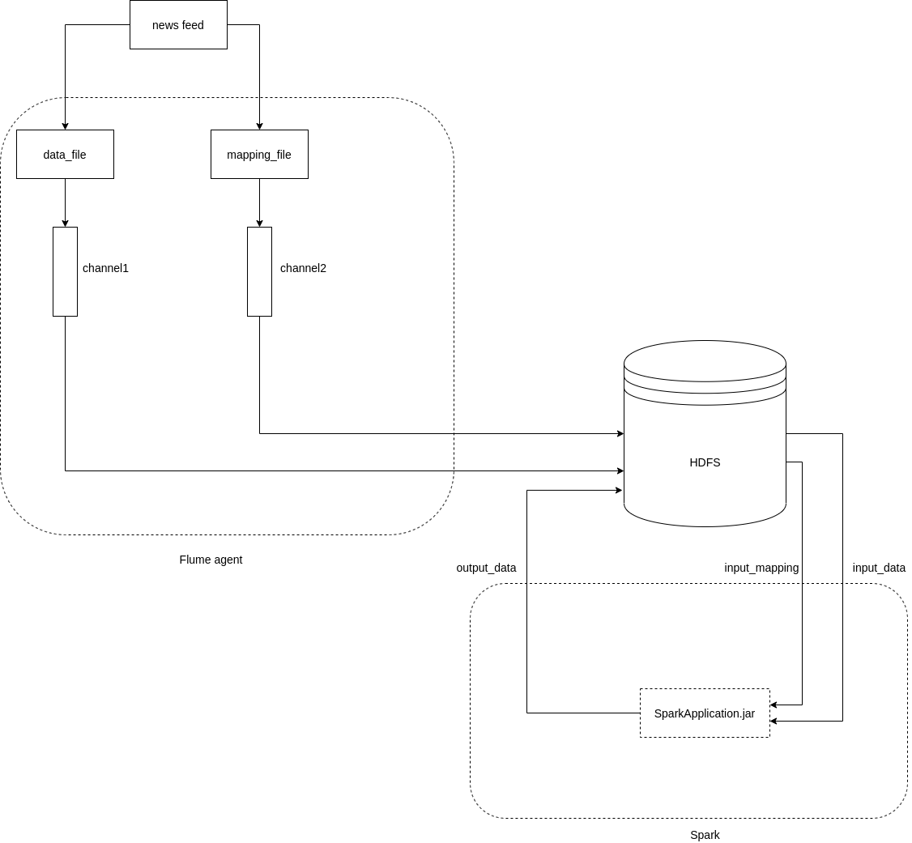

# Description  
Spark application to aggregate news feed logs and Flume agent to transfer data to HDFS

# Required tools  
- JDK (version 8 or later)
- git
- maven
- docker

# Download docker image and create docker network
```
docker pull vladimirnemo/hadoop-single-node-spark:latest
docker pull vladimirnemo/flume-python:latest
docker create network hadoop
``` 

# Build application and start container
```
cd Spark/scripts
bash start_hadoop.sh
```
start_hadoop.sh will compile jar with dependencies, start hadoop cluster and put compiled jar to the container 
NameNode UI will be available at http://localhost:50070 

# Running the application
Run the following command to:
- generate data
- start container with flume agent
- import data to HDFS
- stop container with flume agent
- run Spark job
- show container CLI

```
bash run.sh
```

# To explore output files run the following command in the opened shell

```
$HADOOP_HDFS_HOME/bin/hdfs dfs -cat output/part-00000
```

# To stop cluster and cleanup docker containers related to this application run the following commands in the host terminal
```
docker stop cluster
docker rm cluster
docker network rm hadoop
```
# Components diagram


Screenshots are available [here](./images/README.md)